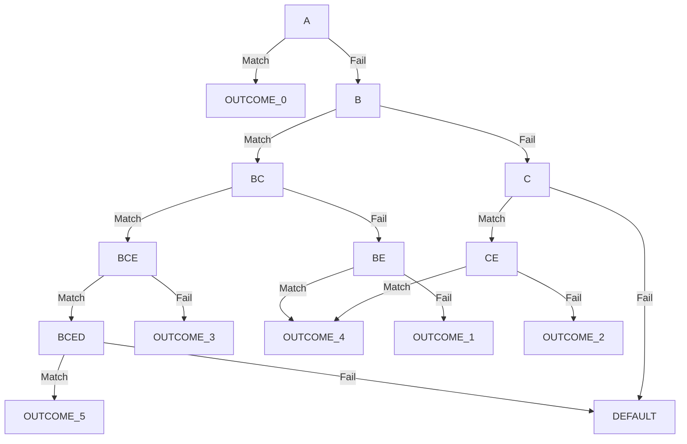

# Decisional tree
Go module to build a decisional tree from a Json file and run a search through it.

## Json structure

#### Option: a combinantion of wanted conditions that should result in a specific outcome.
| **Property** | Description |
| ------ | ----------- |
| **Result**   | The desired outcome, rapresented as a String. |
| **Want**   | A list of Strings, each of them express one necessary condition required for the associated Result. |
| **Or**   | A list of Strings, each of them will be used in combination with the Want values, to produce new Options, in which the Want list will be composed by the starting Want list, plus one of the Or list element. |
    
#### Domain: a list of isolated Options. 
The conditions and the outcomes inside each option of a domain will compose a domain-tree of his own.
If the any of the possible outcomes isn't reached, then the default leaf will redirect to the root of the next domain-tree.
The last domain will just end with default leaves.

This allows the user to configure sectors of the decisional tree that will be isolated between them, and that will only consider that domain conditions to compute the outcome.


## Usage
Inside the [example](https://github.com/GangemiLorenzo/decisional-tree/tree/main/example) folder you can find a basic snippet.

#### Import the module
```go
import "github.com/GangemiLorenzo/decisional-tree/tree"
```

#### Define the condition you are using
```go
const (
	A tree.Condition = "A"
	B tree.Condition = "B"
	C tree.Condition = "C"
	D tree.Condition = "D"
	E tree.Condition = "E"
)
```

#### Build the tree
```go
t := tree.BuildTree("./assets/test_tree.json")
```

#### Run a search
```go
c := tree.Conditions{ 
		B,
		C,
	}
res := t.Search(c) //res will contain the outcome that satisfy the conditions B and C
```

## Example
The following is the json structure used in the given [example](https://github.com/GangemiLorenzo/decisional-tree/tree/main/example).

[test_tree.json](https://github.com/GangemiLorenzo/decisional-tree/blob/main/example/assets/test_tree.json)
```json
{
    "domains": [{
            "options": [{
                "result": "OUTCOME_0",
                "want": [
                    "A"
                ]
            }]
        },
        {
            "options": [{
                    "result": "OUTCOME_1",
                    "want": [
                        "B"
                    ]
                },
                {
                    "result": "OUTCOME_2",
                    "want": [
                        "C"
                    ]
                },
                {
                    "result": "OUTCOME_3",
                    "want": [
                        "C",
                        "B"
                    ]
                },
                {
                    "result": "OUTCOME_4",
                    "want": [
                        "E"
                    ],
                    "or": [
                        "C",
                        "B"
                    ]
                },
                {
                    "result": "OUTCOME_5",
                    "want": [
                        "C",
                        "B",
                        "D",
                        "E"
                    ]
                }
            ]
        }
    ]
}
```

This structure will produce the following tree:

[result.md](https://github.com/GangemiLorenzo/decisional-tree/blob/main/example/result.md)


I'm using [Mermaid](https://mermaid-js.github.io/mermaid/) to display the tree.

