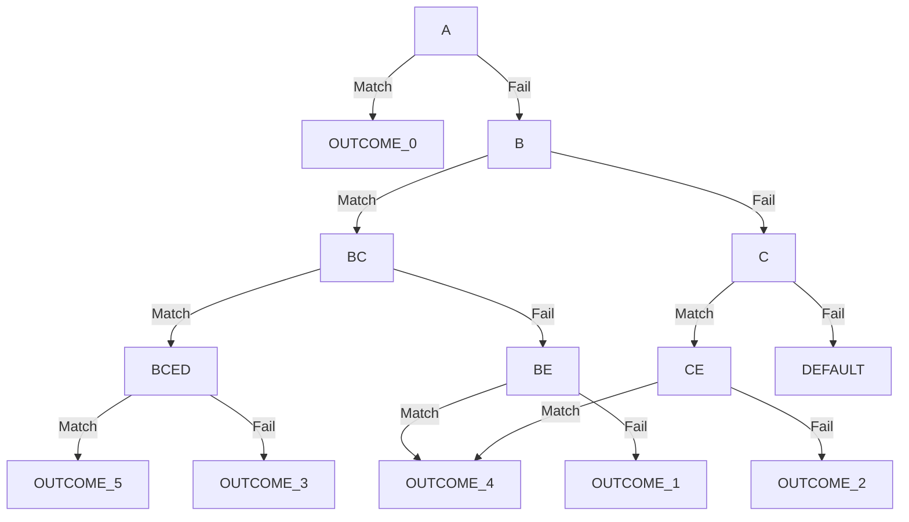

```mermaid
graph TD
A-->|Match|OUTCOME_0;
A-->|Fail|B;
B-->|Match|BC;
BC-->|Match|BCED;
BCED-->|Match|OUTCOME_5;
BCED-->|Fail|OUTCOME_3;
BC-->|Fail|BE;
BE-->|Match|OUTCOME_4;
BE-->|Fail|OUTCOME_1;
B-->|Fail|C;
C-->|Match|CE;
CE-->|Match|OUTCOME_4;
CE-->|Fail|OUTCOME_2;
C-->|Fail|DEFAULT;
```